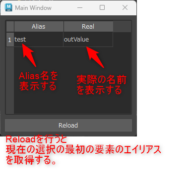
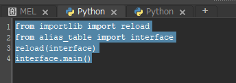

# alias table
選択ノードのエイリアスを表示します。



## 起動方法
1. Mayaのパスが通っているフォルダに配置してください。  
    e.g.  
    {ユーザ}\Documents\maya\scripts 

1. スクリプトエディタ(python)で以下のスクリプトを実行してください。
    ```
    from importlib import reload
    from alias_table import interface
    reload(interface)
    interface.main()
    ```
    